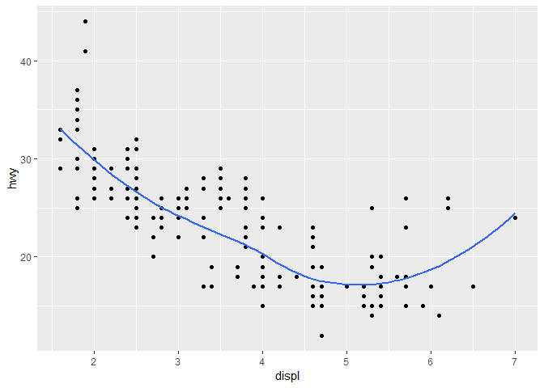
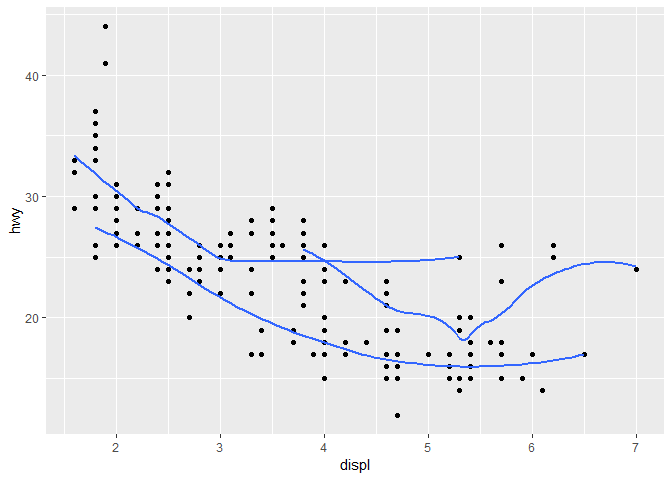
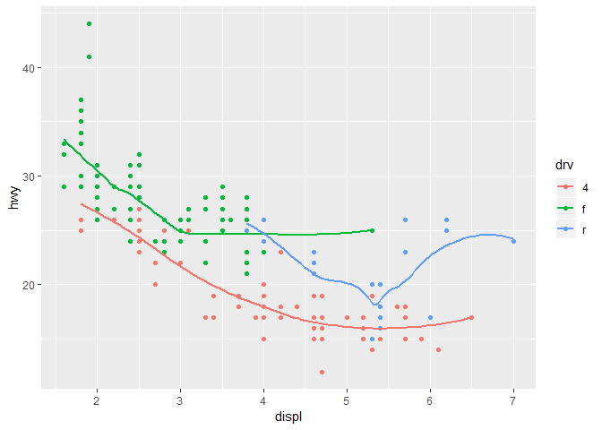
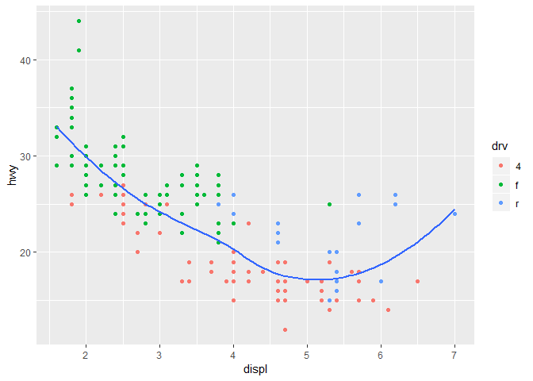
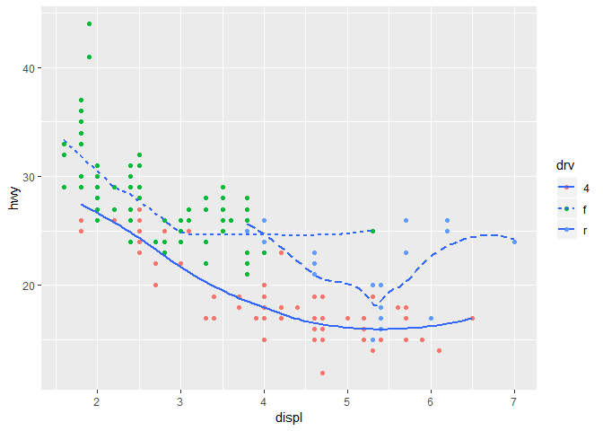
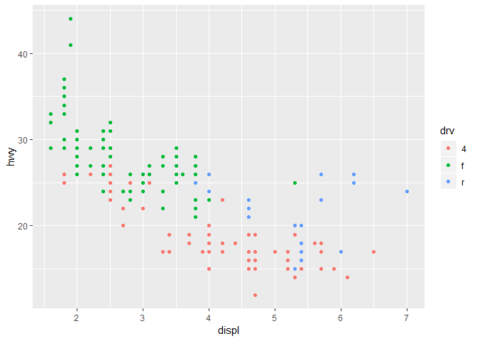
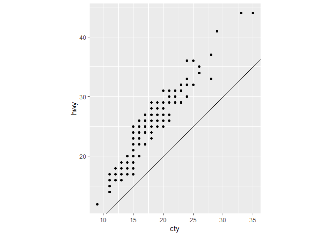
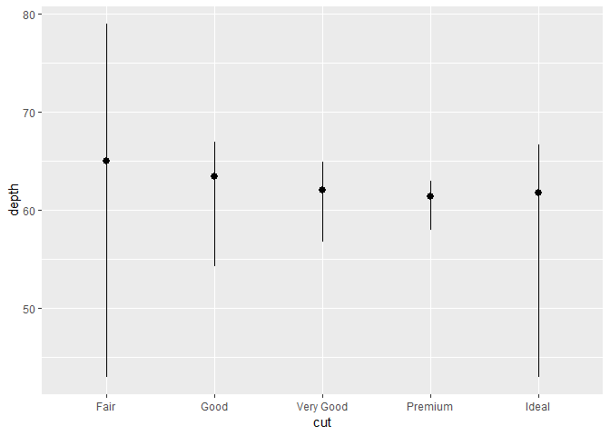
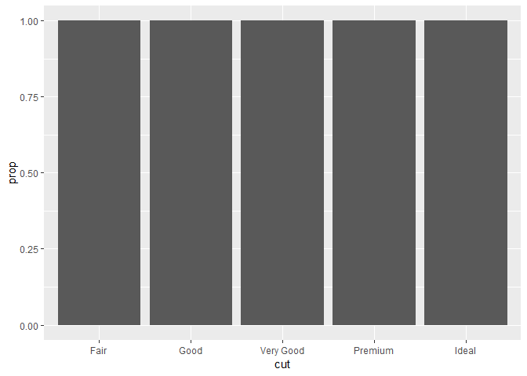
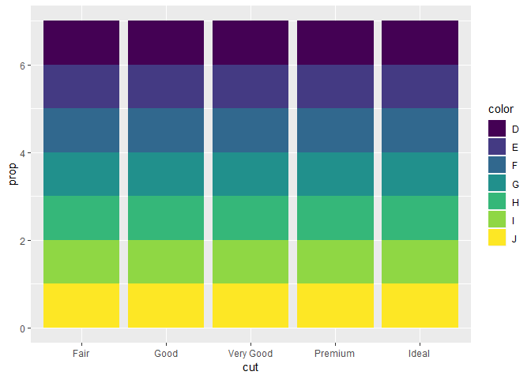

Homework 2: ggplot
================
2019-03-08

``` r
library(tidyverse)
```

    ## -- Attaching packages ------------------------------------------------------------------------------------------------- tidyverse 1.2.1 --

    ## <U+221A> ggplot2 3.1.0       <U+221A> purrr   0.3.1  
    ## <U+221A> tibble  2.0.1       <U+221A> dplyr   0.8.0.1
    ## <U+221A> tidyr   0.8.3       <U+221A> stringr 1.4.0  
    ## <U+221A> readr   1.3.1       <U+221A> forcats 0.4.0

    ## -- Conflicts ---------------------------------------------------------------------------------------------------- tidyverse_conflicts() --
    ## x dplyr::filter() masks stats::filter()
    ## x dplyr::lag()    masks stats::lag()

-   Take the first faceted plot in this section:

``` r
ggplot(data = mpg) + 
  geom_point(mapping = aes(x = displ, y = hwy)) + 
  facet_wrap(~ class, nrow = 2)
```


What are the advantages to using faceting instead of the colour aesthetic? What are the disadvantages? How might the balance change if you had a larger dataset? advantages: Every chart can be observed separatly disadvantages: Graphs are smaller. Too many graphs, especially if you have large dataset

-   Recreate the R code necessary to generate the following graphs.

``` r
knitr::include_graphics(paste0("plots/fig", 1:6, ".png"))
```


``` r
ggplot(data = mpg, mapping = aes(x = displ, y = hwy)) + 
  geom_point() + 
  geom_smooth(se = FALSE)
```

    ## `geom_smooth()` using method = 'loess' and formula 'y ~ x'



``` r
ggplot(data = mpg, mapping = aes(x = displ, y = hwy, class = drv)) + 
  geom_point() + 
  geom_smooth(se = FALSE)
```

    ## `geom_smooth()` using method = 'loess' and formula 'y ~ x'



``` r
ggplot(data = mpg, mapping = aes(x = displ, y = hwy, color = drv)) + 
  geom_point() + 
  geom_smooth(se = FALSE)
```

    ## `geom_smooth()` using method = 'loess' and formula 'y ~ x'



``` r
ggplot(data = mpg) + 
  geom_point(mapping = aes(x = displ, y = hwy, color = drv)) + 
  geom_smooth(mapping = aes(x = displ, y = hwy), se = FALSE)
```

    ## `geom_smooth()` using method = 'loess' and formula 'y ~ x'



``` r
ggplot(data = mpg, mapping = aes(x = displ, y = hwy)) + 
  geom_point(aes(color = drv)) + 
  geom_smooth(aes(linetype = drv), se = FALSE)
```

    ## `geom_smooth()` using method = 'loess' and formula 'y ~ x'



``` r
ggplot(data = mpg, mapping = aes(x = displ, y = hwy, color = drv)) + 
  geom_point() 
```



-   Most geoms and stats come in pairs that are almost always used in concert. Read through the documentation and make a list of all the pairs. What do they have in common?

-   Compare and contrast geom\_jitter() with geom\_count().

Both are helpful when data overlaping exists. They help to distinguish many points on the same place. Geom\_ponit maps the count to point area Geom\_jitter adds random values to the points, so that they are not on the same location anymore.

-   What does the plot below tell you about the relationship between city and highway mpg (fuel consumption)? Why is coord\_fixed() important? What does geom\_abline() do?

The relationship is linear coord\_fixed() - scales the graph,it is responsible for x and y axes ratio. geom\_abline() - adds the line below, what is capable of showing the trend.

``` r
ggplot(data = mpg, mapping = aes(x = cty, y = hwy)) +
  geom_point() + 
  geom_abline() +
  coord_fixed()
```



-   What is the default geom associated with stat\_summary()? It is geom\_pointrange

``` r
ggplot(data = diamonds) + 
  stat_summary(
    mapping = aes(x = cut, y = depth),
    fun.ymin = min,
    fun.ymax = max,
    fun.y = median
  )
```



How could you rewrite the previous plot to use that geom function instead of the stat function?

-   What does geom\_col() do? How is it different to geom\_bar()?

geom\_bar() makes the height of the bar proportional to the number of cases in each group. geom\_col() - heights of the bars to represent values in the data

-   What variables does stat\_smooth() compute? What parameters control its behaviour? it presents common value. Different smooth functions are available y ~ x, y ~ poly(x, 2), y ~ log(x)

-   In our proportion bar chart, we need to set group = 1. Why? In other words what is the problem with these two graphs?

We cannot see the relationship between different classes, so we do not know what part Fair/D makes from all amount

``` r
ggplot(data = diamonds) + 
  geom_bar(mapping = aes(x = cut, y = ..prop..))
```



``` r
ggplot(data = diamonds) + 
  geom_bar(mapping = aes(x = cut, fill = color, y = ..prop..))
```


